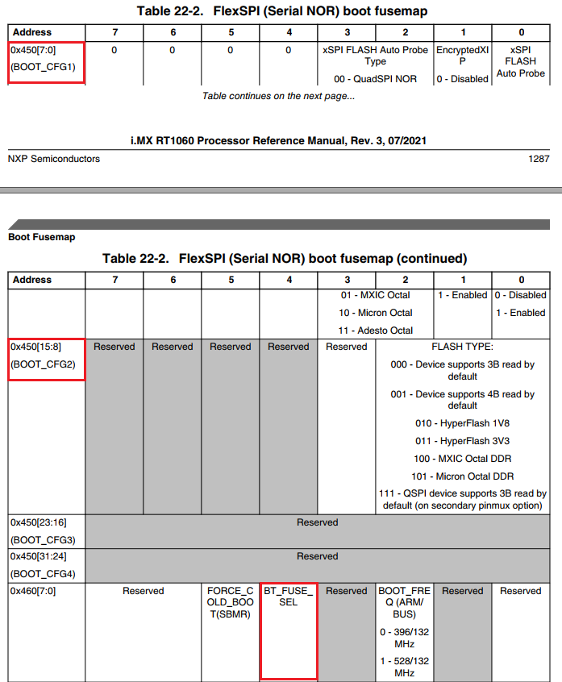

# All in One i.MXRT10xx SPI Flash Algorithm for IAR

## 闲唠：		

外部SPI Flash的在线调试烧写问题自打i.MXRT发布以来就一直相伴而生（没办法啊，谁让它自打娘胎里出生就不带内置Flash呢），期间很多RT用户在抱怨外部SPI Flash烧写的兼容性问题和稳定性问题，作者我本人更是历经千锤百炼软磨硬泡方才求得真经，练就一身好脾气，咳咳，现在回过头来，一声感叹，一切皆是浮云遮住了望眼，拨云见日之后会发现，so easy~妈妈再也不用担心我没事乱拍桌子了。。。

## 项目来源

RT1050/RT1020的SPI Flash烧写算法一直以来都是各自为政，不同的IDE（IAR，Keil和MCUXpresso），不同的调试工具（J-Flash）都是维护自己的一套Flash烧写算法，再加上一些NXP第三方partner（比如野火，正点原子，周立功）也会针对自己的开发板适配板载QSPI Flash的算法，毕竟NXP官方没给出一个统一的烧写算法，大家只能是怎么方便怎么来了。好在自打i.MXRT1060以后的产品，其芯片自带的ROM里包含了一套完整的Flash操作API，而且IAR最新版本里针对RT1060以及以后的产品都是使用这个标准统一的API来操作外部SPI Flash（代码不可见，只开放API供调用）。不过“后浪”的确弥补了这个缺憾，那“前浪”咋办，不能就晾在沙滩上吧？？虽然作为已经量产很久的RT1050/RT1020，它的ROM不可能后面再加上去这套API了，但是NXP虽然关上了一道门却敞开了一扇窗，在RT1050/RT1020的SDK软件包里实际上是包含了这套统一SPI Flash操作的API源码的（\boards\evkbimxrt1050\bootloader_examples\flashloader），这套源码很庞大，包含了UART/USB通信以及SD卡/eMMC/SPI Nand/SPI Nor等其他Memory的操作，我花了不少时间，踏坑无数之后，方摘出来最精简的代码来实现IAR下真正的All in One Flash烧写算法，并规避修正了一些之前遇到过的IAR调试出现的莫名其妙的问题，希望能就此终结i.MXRT SPI Flash在IAR下调试仿真的问题，让大家自由的在RT产品中放飞自我，哈哈。

## 使用方法：

至于大家关心的Keil下的Flash算法，我实际上之前开源过一个版本并放到我的博客里，不过后面测试还是有些不稳定的，待该最新版算法测试稳定之后，我会更新到Keil下，请大家关注我之前的那篇Keil算法博客更新。下面让我们看看，这套算法怎么使用吧：

### 如何生成flashloader执行文件.out

（1）首先该算法工程支持RT1050, RT1020和RT1060（RT1060 IAR官方给的是调用ROM API的方式，我这里是给出SDK里的源码，不保证完全一样哈，只能说是用法一致）如下图，选择不同的工程配置之后，重新编译链接以生成不同的Flash烧写算法可执行文件.out；

（2）将上一步生成的.out文件以及本工程目录下对应芯片的.flash文件（以RT1050为例，FlashIMXRT1050_EVK_FlexSPI.out和FlashIMXRT1050_EVK_FlexSPI.flash这两个文件）拷贝到IAR的安装目录下（以我电脑路径为例，C:\Program Files (x86)\IAR Systems\Embedded Workbench 8.4\arm\config\flashloader\NXP），覆盖源文件即可。这里可能会有疑问，只拷贝.out文件不就行吗，它是真正的Flashloader可执行文件，为什么还要拷贝.flash文件呢。IAR自带的.flash文件里会要求下载时先加载.mac脚本文件以初始化MCU的时钟以及管脚复用等操作，但是我修改后的flash烧写算法已经把时钟初始化和管脚配置都放在.out文件里了，这样就没必要再加载.mac初始化脚本了，所以新的.flash文件我去掉了预加载.mac文件的步骤；

### SPI Nor Flash QE位的问题说明

接下来就是要讨论目前SPI Flash的兼容性问题，这个我之前在Keil烧写算法博客里已经吐槽过一次了。i.MXRT如果是在XIP模式下工作的话（代码执行在片外SPI Nor Flash），片外的SPI Flash带宽是很大的一个瓶颈，所以我们尽可能地都是把Flash的频率设成最快，同时把支持4线SPI模式使能（目前应该绝大多数SPI Flash都支持四线了），而JEDEC组织当年发布第一个SPI Flash标准版本JEDEC216的时候，我猜测那会儿应该各个Flash厂家并没有4线模式的产品（或者当年开会讨论的时候喝高了把这个事忘了？Who knows），所以并没有把QE（四线使能位）加入Flash自带的SFDP（Serial Flash Discoverable Parameters）表里面，而后面各大厂家出来4线模式之后，这个QE位的乱象就出来了，不同家的Flash甚至一个厂家的Flash它的QE位使能方式都是不一样的，这个乱象直到2013年JEDEC216A版本出来后才把QE位加入到SFDP里面，但是已经来不及了，我查看了下，目前市面上常用的几个SPI Flash厂家（包括GD，Winbond和MXIC）生产的大多数产品仍然只兼容JEDEC216最早期版本（我的采集样本少了点，只看到了ISSI的SPI Nor Flash兼容216A），这就意味着，任何一个算法都没办法通过统一的命令（一般常用SFDP读命令）来获取QE位的使能方法，所以我们看到目前市面上的所有SPI Flash烧写器默认配置都是只把image烧进去并不管QE的使能与否，除非手动修改或者定制化。

### 命令配置字

所以无论是IAR自带的RT1060 ROM API方式的Flash烧写算法还是我自己移植过来的算法内部都有通过SFDP命令获取SPI Flash的操作命令格式，但是会判断它的协议版本，如果是A版本及以后的版本，软件会从SFDP表里自动读取QE使能方式并使能，如果是第一个版本的JEDEC216就需要外部手动给该Flash算法输入命令配置字（默认不使能），该命令配置字格式如下图：

该命令配置字Option0为32位格式数据，每个参数占用4bits，这里我重点提一下Max Freq和QE Type这两个参数，其中Max Freq见下表，需要根据自己选择的Flash数据手册填入对应的数字（没错，这个最大频率也没包括在SFDP里，所以只能是手动了），Flash算法会按照该参数配置RT芯片的FlexSPI接口时钟来擦写Flash，所以把该值配置成spec可允许的最大值可以提高烧写速度，至于QE的使能方式，目前市面上绝大多数SPI Flash一共存在上表列出的4种方式，也是需要查看自己选用的Flash数据手册来，下图我列了两个常用的SPI Nor Flash(GD25Q32和W25Q32)的QE使能方式供参考，其中GD25Q32的配置字应为0xC0000406，而W25Q32的配置字应为0xC0000205，其他家产品依此方式查找对比即可。

### 如何给IAR Flashloader传入命令配置字

（1）下面我们接着看在IAR下如何把通过上述方法得到的配置字作为参数传给Flash烧写算法，右键你的应用工程，进入Debugger->Download，勾选中Override default .board file，然后点击下面的Edit；

（2）接着点击下面的Edit（还记得这个.flash文件吧，前面提到的Flash算法工程目录下让一块拷贝的文件，在这里也是有用的），最后在Extra Parameters里面敲入--Opt0 0xC0000205，即可适配华邦W25Q32的SPI NorFlash了；

（3）最后选择上面两图的Ok即会弹出保存按钮，把新改好的Debug配置文件.board保存在当前应用代码的工程目录下如下图，以后再点击IAR的调试下载按钮就可以把我们上面填进去的参数传给Flash擦写算法了。

### 常用QSPI Norflash配置字示例

为了大家刚开始不熟悉搞错，也是为了给大家demo打个样，下面我列了几个常用的SPI Nor Flash的配置字可以直接使用，不在此列表里的则要参考我上面提到的方法来自己配置了，再搞不定那就抱歉了，我也帮不到你了，咳咳。

|                          Flash型号                           |    Opt0配置字    |
| :----------------------------------------------------------: | :--------------: |
|                         GD25Q32/Q64                          |    0xC0000406    |
|                      W25Q80/Q16/Q32/Q64                      |    0xC0000205    |
|                          MX25L6433F                          |    0xC0000105    |
|                  IS25LP032/064（JEDEC216A）                  | 0xC0000107(选配) |
| S26KS512SDPBHI02 (HyperFlash 1.8v, EVK_RT1050默认Flash) |    0xC0233009    |

### 如何使能Flash算法的烧写熔丝位功能

i.MXRT系列在Internal Boot模式下正常启动时，默认配置会在POR_B复位管脚上升沿的时刻从Boot CFG GPIO管脚获取到电平状态并装载到SRC_SBMR1寄存器，然后BOOT_ROM会以该寄存器的值来决定外部启动设备的类型和相关的启动配置，比如Flexspi接口启动还是SEMC接口启动还是SDHC启动，还有Flexspi是Norflash启动还是Nandflash启动，以及启动时的时钟频率和使用的哪组管脚配置，具体请查询i.MXRT RM手册SystemBoot章节（注意不同RT系列，它的BOOT_CFG对应的IO管脚可能是不一样的，下图是RT1060的）。

不过在实际应用中，有些系统设计对IO利用率要求较高，由于可用IO数量不够而使用到BOOT_CFG相关的IO管脚同时外部电路又没办法保证在刚上电时POR_B上升沿时刻这些管脚的电平状态是可控的，这种情况下如果继续使用Internal Boot模式下的默认配置则可能会由于启动配置装载的IO状态不是预期的进而导致MCU启动失败（可通过dump SRC_SBMR1寄存器看到BOOT_CFG信号不正常非预期）。针对这种情况，i.MXRT在Internal Boot模式下提供了从内部eFuse熔丝位获取启动配置的方式，即MCU上电复位后不再从BOOT_CFG IO管脚电平获取启动配置而是使用内部eFuse的配置，具体见RM手册SystemBoot章节如下图，当内部熔丝位BT_FUSE_SEL写成1之后（出厂默认为0），GPIO状态不再决定启动配置而是由eFuse熔丝内部的BOOT_CFG1和BOOT_CFG2位决定。

从上述解释说明我们知道了通过烧写内部eFuse熔丝位BT_FUSE_SEL和BOOT_CFG1和2可以决定RT的启动配置，那这两个熔丝位的位置具体在哪里以及如何写入。从RT的RM手册里Fusemap章节找到boot fusemap table如下，可以看到BOOT_CFG1和2位于eFuse地址0x450的[15:0]位，BT_FUSE_SEL位于地址0x460的bit4位，这些eFuse位出厂默认均为0，如果用户的外部Flash是我们平时最常用的QSPI Flash的话，则从下图eFuse位说明可以看到BOOT_CFG1和2位不需要再写入（保持0即可），我们只需要把BT_FUSE_SEL写1即可（注意eFuse只能从0写成1，而且只能写一次）。

本项目最新的Flash烧写算法新加入了对eFuse熔丝位的写入支持，一旦使能了该功能后，用户在给RT下载更新程序的同时也会写入eFuse，对用户来说是无感的，最大程度减少用户额外的操作，不过对eFuse的写入大家一定要谨慎，因为eFuse一旦从0写成1就无法再逆向回去了 （这也是叫做熔丝位的原因）。如下图1，加入了eFuse的写入，不过默认是不生效的，用户如果想使能eFuse的烧写的话，需要参照本文前面提到的IAR中传入--Opt的方法给IAR的flashloader传入--BT_FUSE这个参数，如下图2。

对于上述的eFuse写入代码，这里简单解释一下，由于eFuse是一块独立的物理存储空间不在CPU内部的4G可寻址空间范围内，要对其进行操作需要借助于OCOTP控制器，而eFuse的地址和OCOTP里的地址有个映射关系即eFuse address = OCOTP index * 0x10 + 0x400，所以上图中我们传入OCOTP的参数0x06对应的是eFuse空间中的0x460，也就是BT_FUSE_SEL熔丝位所在的物理空间地址。如果用户想要操作其他eFuse空间，则可以参考该代码中的API用法自行添加和修改，但是一定要注意对eFuse的操作是一次性的。

## 项目维护者：

jicheng0622

## 联系方式：

jicheng0622@163.com

## Readme 图片显示不了？参考如下链接即可
https://blog.csdn.net/weixin_42128813/article/details/102915578
