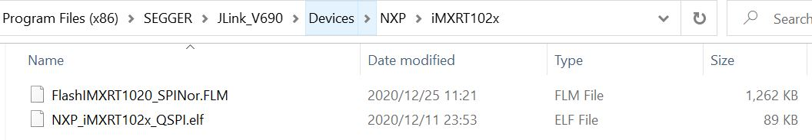
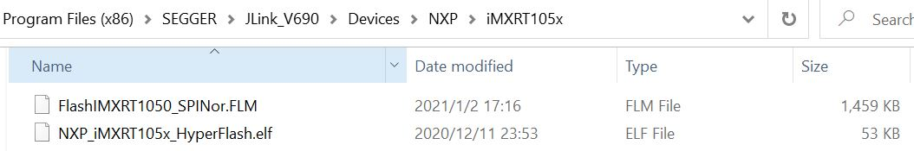
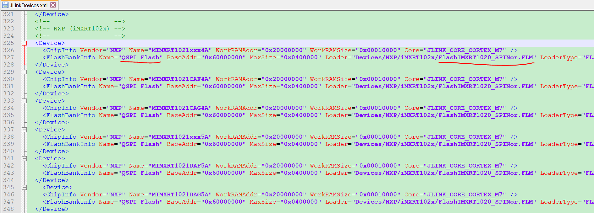
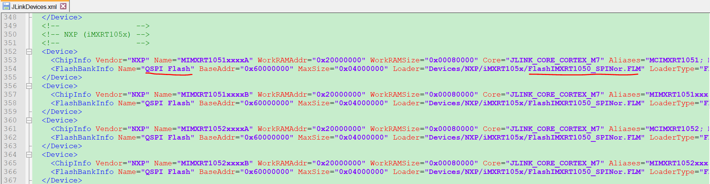
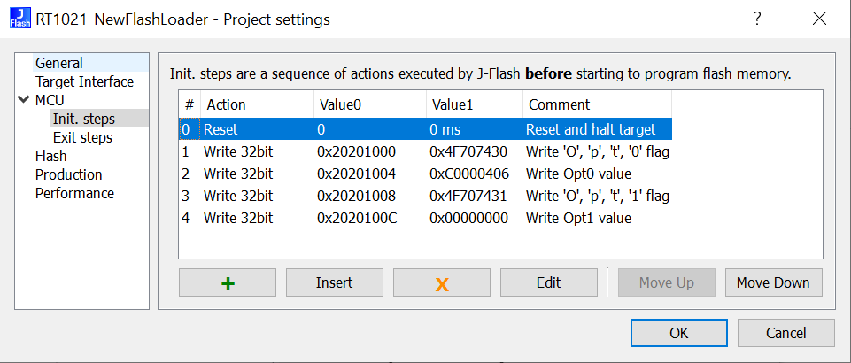
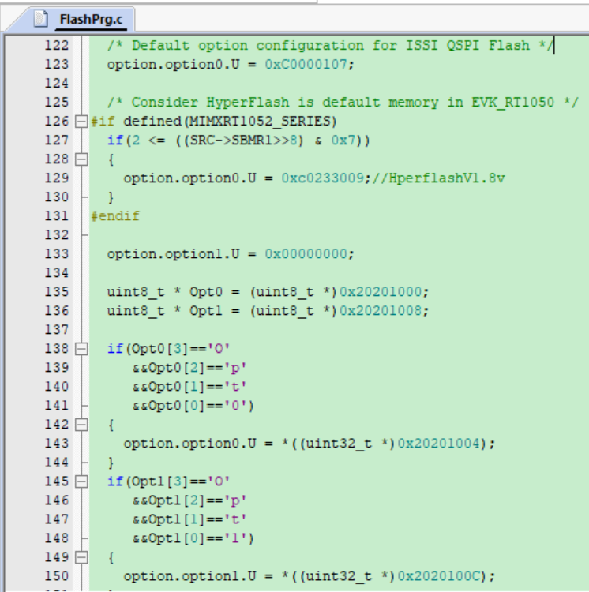
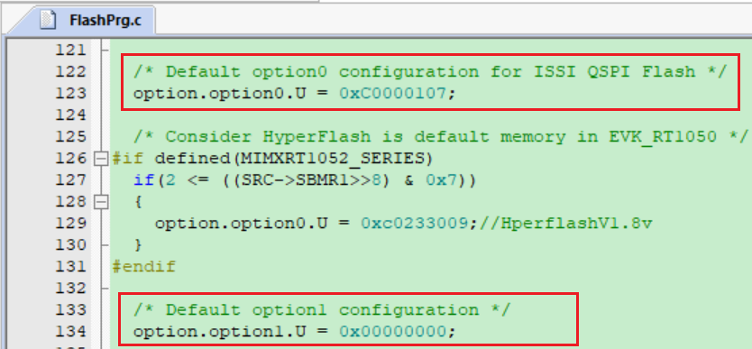

# All in One i.MXRT1050/RT1020 SPI Flash Algorithm for J-Flash

在阅读此文之前强烈建议先通读一遍我在[AllinOne Flash Alorigthm for IAR](https://github.com/jicheng0622/All-in-One-Flash-Algorithm-for-RT1050-RT1020/tree/master/IAR)项目里的Readme以了解AllinOne的初衷以及原理机制，J-Flash的flash算法实现在原理上跟IAR下是一致的。此次把J-Flash和Keil下的flash算法也更新完之后，此AllinOne项目算是告一段落了，后面会在有需要的时候更新些功能或者修正用户反馈的bug，望大家在RT Design的路上无此忧，偶心足矣。。。

## 测试平台

*开发板：*i.MXRT1021_EVK, i.MXRT1050_EVK

*SPI Flash:* IS25LP64, GD25Q32, S26KS512(HyperFlash)

*Tool:* J-Link_v9, J-Flash_v6.90, Keil_v5.31, Segger Embeded Studio_v5.4

## 使用方法：

（1）在AllinOne Flash Algorithm for J-Flash项目中我创建了两个算法工程，其中一个为Keil版本的CMSIS标准flash算法(生成.FLM算法文件)，另外一个为Segger公司提供的Segger Embeded Studio版本的快速Flash算法（.elf算法文件），J-Flash两种算法都可以支持，只是道理大家都明白，毕竟J-Flash一套都是Segger自家亲儿子，Segger提供的那一套快速Flash算法模板，我移植过去之后亲测速度非常快，尤其是Verify过程（唰的一下，飞一般的感觉~），它使用了CRC校验的方法而非标准CMSIS的回读比对方式校验，效率提高了几倍不止，只是CRC校验方法Segger只提供了Segger Embeded Studio版本编译的静态库（Segger好心机啊。。。），所以我不得不单独创建了一个Embeded Studio算法工程；

（2）从我的[Github repo](https://github.com/jicheng0622/All-in-One-Flash-Algorithm-for-RT1050-RT1020)下载AllinOne Flash Algorithm for J-Flash两个代码工程（Keil版本和Segger Embeded Studio版本），看个人喜好选择其中一种（个人推荐后者，Embeded Studio虽然是后来之秀，但是我一直很盲目的崇拜和相信Segger，用起来的确很舒爽），选择分别选择FlashRT1020_SPINor和FlashRT1050_SPINor编译通过，此时可以在工程目录下生成FlashIMXRT1020_SPINor.FLM和FlashIMXRT1050_SPINor.FLM算法文件（Keil版本，路径根目录）或者FlashIMXRT1020_SPINor.elf和FlashIMXRT1050_SPINor.elf算法文件（Segger版本，路径\Output\FlashIMXRT1050_SPINor\Exe）；

**注意：Keil下的FLM算法文件与J-Flash下的FLM算法文件不能通用**

（3）将两个Flash算法文件分别对应的拷贝到J-link安装目录下\SEGGER\JLink_V690\Devices\NXP\iMXRT102x和\SEGGER\JLink_V690\Devices\NXP\iMXRT105x文件夹里如下图，下图仅以Keil版本的FLM文件为例：

**注意：如果是Segger版本的算法文件应该是elf文件**

（4）回到J-link安装目录\SEGGER\JLink_V690路径下，用文本编辑工具（e.g Notepad++）打开JLinkDevices.xml文件，将RT1020和RT1050的flash算法路径信息添加到该文件里如下图（在Jlink_v6.90的xml文件里默认有RT1050的路径信息，只需要参考下图修改flash算法的名字即可，而RT1020的路径信息没有，它包含在Jlink的DLL动态链接库里，所以需要完整添加下图中关于RT1020的所有信息以覆盖DLL里的内容），为了方便大家拷贝添加信息我也把Jlink_v6.90里修改过的JLinkDevices.xml源文件一并上传到github代码仓库里（路径All-in-One-Flash-Algorithm-for-RT1050-RT1020/J-Flash）；

**重要提示：如果是Segger版本的话，记得把下图中的所有FlashIMXRT1050_SPINor.FLM和FlashIMXRT1020_SPINor.FLM后缀都改为FlashIMXRT1050_SPINor.elf和FlashIMXRT1020_SPINor.elf**

（4）打开J-Flash工具创建新Project，在Target Device列表里选择RT1021或者RT1052，另外要注意的是i.MXRT系列默认的调试端口为SWD而非JTAG(使能JTAG调试需要提前烧eFuse配置才可以)。工程创建完毕之后，我们上述新添加的Flash烧写算法实际上已经被J-Flash先load进去了，此时如果是官方RT1021/RT1052_EVK默认板载Flash的话，我们把待烧写的bin/hex/srec文件拖到J-Flash工具里之后就可以点击菜单栏Target->Connect或者直接点击Target->Production Programming触发J-Link烧写image到目标芯片上了。

### 如何给J-Flash Flash烧写算法传入命令配置字

如我在AllinOne Flash Algorithm for IAR项目里的详细解释，该算法可以支持符合JEDEC-216A及以后版本直接烧写，因为QE bit即4线使能位可以通过SFDP命令读取出来，这样算法可以解析命令并自动把QE bit置位，而对于老版本的JEDEC216 SPI Flash（市面上很多常用的QSPI Flash仍然是该版本），flash算法无法自动获取QE的位置和对应的使能命令，此时就需要手动地给Flash算法输入一个Option0命令告诉它怎么去使能QE（至于如何获取不同JEDEC216 QSPI Flash的Option0命令请参考AllinOne Flash Algorithm for IAR项目里面的说明），此外如果外部QSPI Flash挂在RT1050的Secondary pinmux组上作为启动设备的话还要另外输入Option1命令。那在J-Flash里如何给Flash算法输入这两个参数呢？

我这里给了一种解决方案，点击J-Flash菜单栏Options->Project settings，在里面找到Init. steps，在里面添加如下图的4条命令，即在指定的memory address（0x20201000~0x20201010 RT1020/1050的OCRAM寻址空间）里输入Option0和Option1的标志和参数（0x4F707430位Opt0的ASCII码，另外之所以加标志判断是确保Opt0/1的value是我们输入的而不是OCRAM本身的不确定的值），然后在flash算法里添加对应的判断和解析处理，这样即可完成外部参数的输入了。

至此我们就完全实现了AllinOne Flash Algorithm for J-Flash的功能了，此时我们再点击Target->Connect或者Target->Production Programming即可触发J-Link对目标芯片的烧写了。实际上相比于IAR里的区别，J-Flash只是需要解决Option0和Option1的外部参数输入问题，下面我也是给出了几个常用的QSPI Norflash配置字的示例供大家参考。

### 常用QSPI Norflash配置字示例

|                          Flash型号                           |    Opt0配置字    |
| :----------------------------------------------------------: | :--------------: |
|                         GD25Q32/Q64                          |    0xC0000406    |
|                      W25Q80/Q16/Q32/Q64                      |    0xC0000205    |
|                          MX25L6433F                          |    0xC0000105    |
|                  IS25LP032/064（JEDEC216A）                  | 0xC0000107(选配) |
| S26KS512SDPBHI02 (HyperFlash 1.8v, EVK_RT1050默认Flash) |    0xC0233009    |

当然如果是用户片外的SPI Flash型号固定不变的话，最简单的方式就是直接打开Keil Flash算法工程然后修改默认的Option0和Option1的配置，重新编译生成你想要的FLM算法文件之参考上面提到第（2）和第（3）步去做即可。

## 项目维护者：

jicheng0622

## 联系方式：

jicheng0622@163.com