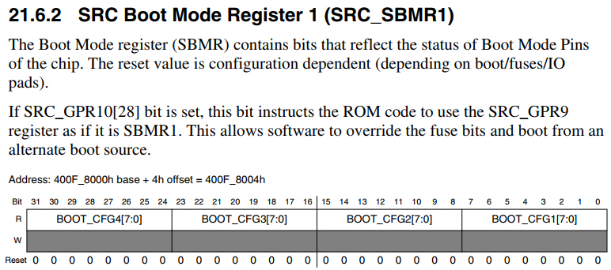
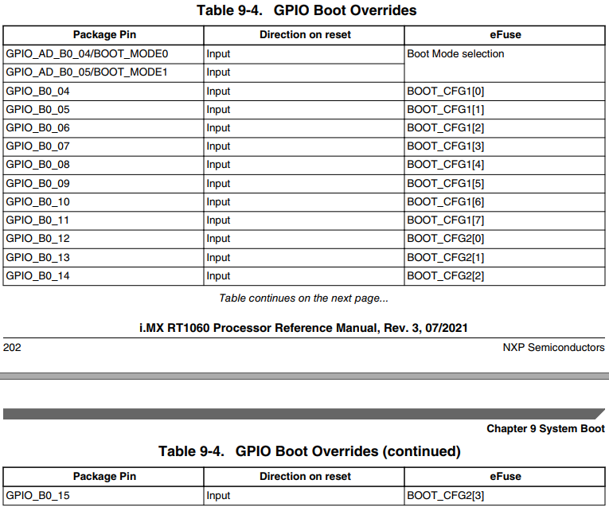
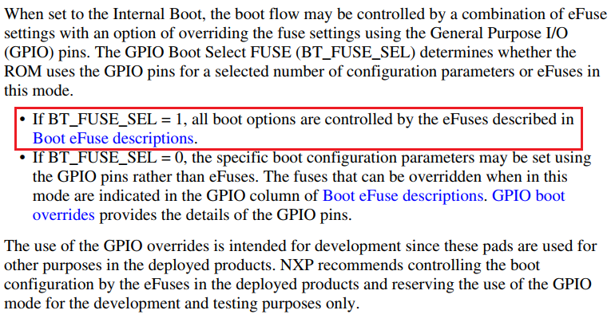
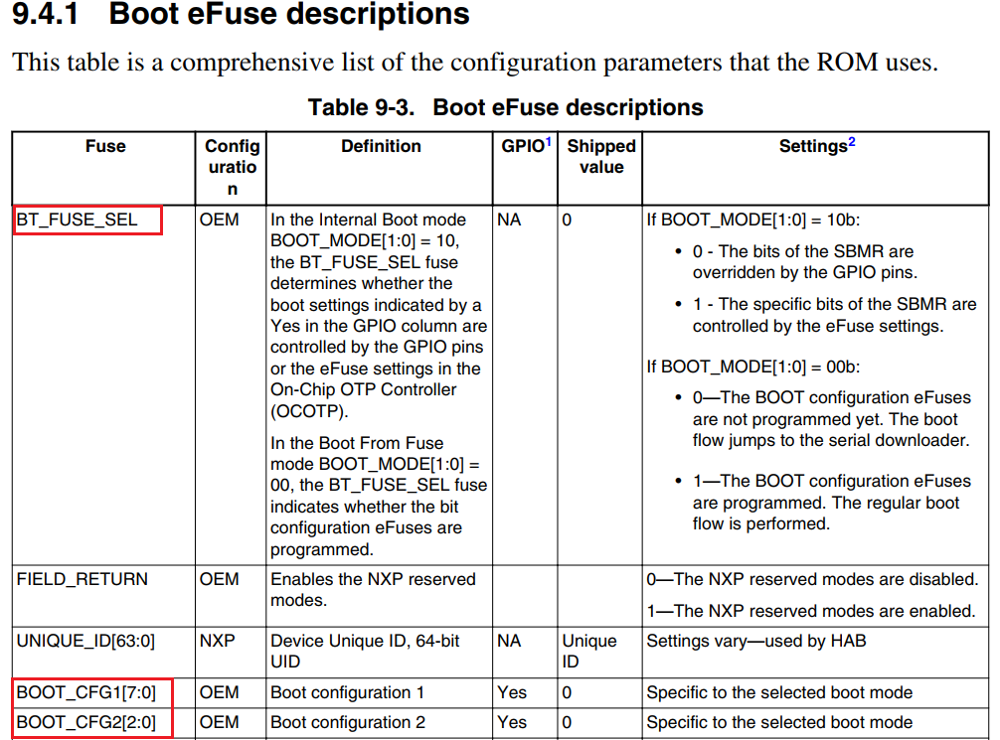
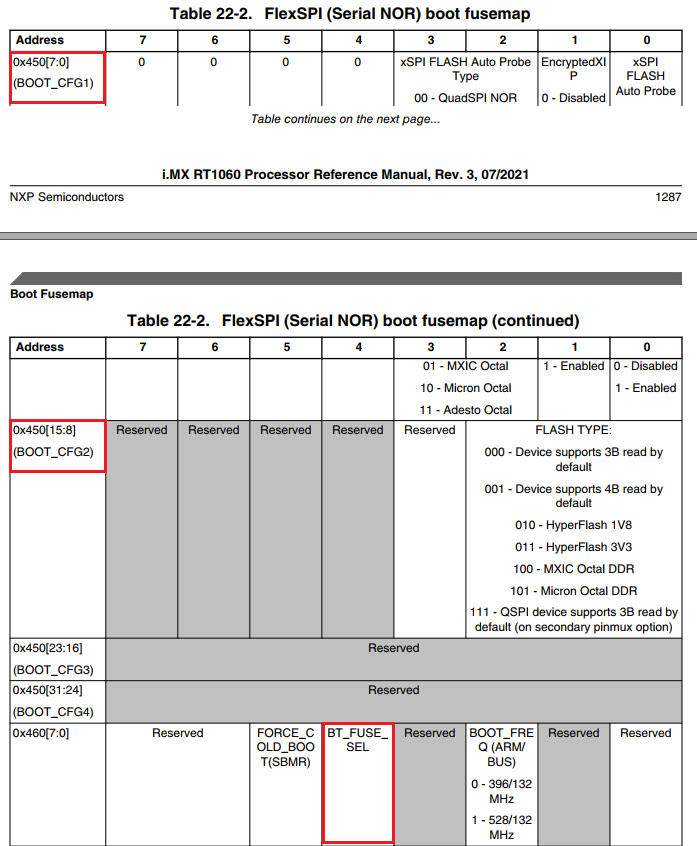
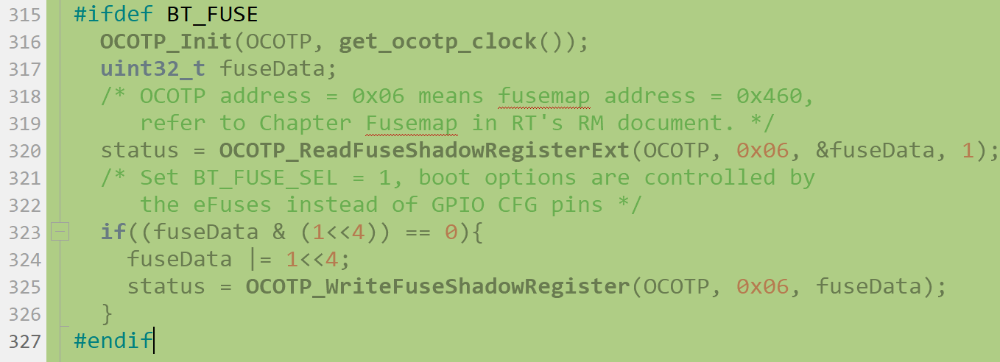

# All in One i.MXRT1050/RT1020 SPI Flash Algorithm for Keil

在阅读此文之前强烈建议先通读一遍我在[AllinOne Flash Alorigthm for IAR](https://github.com/jicheng0622/All-in-One-Flash-Algorithm-for-RT1050-RT1020/tree/master/IAR)项目里的Readme以了解AllinOne的初衷以及原理机制，Keil的flash算法实现在原理上跟IAR下是一致的。此次把J-Flash和Keil下的flash算法也更新完之后，此AllinOne项目算是告一段落了，后面会在有需要的时候更新些功能或者修正用户反馈的bug，望大家在RT Design的路上无此忧，偶心足矣。。。

## 测试平台

*开发板：*i.MXRT1021_EVK, i.MXRT1050_EVK, i.MXRT1060_EVK

*SPI Flash:* IS25LP64, GD25Q32, S26KS512(HyperFlash)

*Tool:* J-Link_v9, Keil_v5.31

SDK: SDK_2.6.1

## 使用方法：

（1）从我的[Github repo](https://github.com/jicheng0622/All-in-One-Flash-Algorithm-for-RT1050-RT1020)下载AllinOne Flash Algorithm for Keil代码工程并在Keil环境下分别选择FlashRT1020_SPINor或者FlashRT1050_SPINor或者FlashRT1060_SPINor编译通过，此时可以在工程根目录下生成对应的.FLM算法文件，将生成的Flash算法文件拷贝到Keil安装目录下C:\Keil_v5\ARM\Flash文件夹里；

**注意：Keil下的FLM算法文件与J-Flash下的FLM算法文件不能通用**

（2）打开Keil应用工程（以RT1021 SDK2.6.1路径\driver_examples\gpio\led_output\mdk为例），进入Options->Debugger->Settings->Flash Download，点击“Add”选择MIMXRT1021_SPINor_AllinOne（如果板载芯片是RT1050的话需要选择MIMXRT1050_SPINor_AllinOne），然后点击"OK"退出；

（3）上述两步已经将新添加的Flash烧写算法load到对应工程了，此时如果是官方RT1021/RT1050/RT1060_EVK默认板载Flash的话，在把当前工程编译成功之后即可点击Keil菜单栏Flash->Download或者debug按钮将编译后的image烧写到片外SPI Nor Flash里。

### 如何给Keil Flash烧写算法传入命令配置字

如我在AllinOne Flash Algorithm for IAR项目里的详细解释，该算法可以支持符合JEDEC-216A及以后版本直接烧写，因为QE bit即4线使能位可以通过SFDP命令读取出来，这样算法可以解析命令并自动把QE bit置位，而对于老版本的JEDEC216 SPI Flash（市面上很多常用的QSPI Flash仍然是该版本），flash算法无法自动获取QE的位置和对应的使能命令，此时就需要手动地给Flash算法输入一个Option0命令告诉它怎么去使能QE（至于如何获取不同JEDEC216 QSPI Flash的Option0命令请参考AllinOne Flash Algorithm for IAR项目里面的说明），此外如果外部QSPI Flash挂在RT1050的Secondary pinmux组上作为启动设备的话还要另外输入Option1命令。那在Keil里如何给Flash算法输入这两个参数呢？

我这里给了一种解决方案，打开Keil工程目录下的evkmimxrt1020_flexspi_nor.ini文件，添加如下图红色圆圈里的代码，即在指定的memory address（0x20201000~0x20201010 RT1020/1050/1060的OCRAM寻址空间）里输入Option0和Option1的标志和参数（0x4F707430位Opt0的ASCII码，另外之所以加标志判断是确保Opt0/1的value是我们输入的而不是OCRAM本身的不确定的值），然后在flash算法里添加对应的判断和解析处理，这样即可完成外部参数的输入了。同时需要在Options->Utilites选项卡里选择如下图2，这样即可在触发Flash Download之前把Option0和Option1参数传入Flash算法之中。

至于Flash烧写算法是如何判断和解析这Option0和Option1这两个参数，参见下图：

至此我们就完全实现了AllinOne Flash Algorithm for Keil的功能了，此时我们再点击Keil菜单栏Flash->Download或者debug按钮将编译后的image烧写到对应匹配的片外SPI Nor Flash里了。实际上相比于IAR里的区别，Keil只是需要解决Option0和Option1的外部参数输入问题，下面我也是给出了几个常用的QSPI Norflash配置字的示例供大家参考。

### 常用QSPI Norflash配置字示例

|                          Flash型号                           |    Opt0配置字    |
| :----------------------------------------------------------: | :--------------: |
|                         GD25Q32/Q64                          |    0xC0000406    |
|                      W25Q80/Q16/Q32/Q64                      |    0xC0000205    |
|                          MX25L6433F                          |    0xC0000105    |
|                  IS25LP032/064（JEDEC216A）                  | 0xC0000107(选配) |
| S26KS512SDPBHI02 (HyperFlash 1.8v, EVK_RT1050默认Flash) |    0xC0233009    |

当然如果是用户片外的SPI Flash型号固定不变的话，最简单的方式就是直接打开Keil Flash算法工程然后修改默认的Option0和Option1的配置，重新编译生成你想要的FLM算法文件之参考上面提到第（1）和第（2）步去做即可。

### 如何使能Flash算法的烧写熔丝位功能

i.MXRT系列在Internal Boot模式下正常启动时，默认配置会在POR_B复位管脚上升沿的时刻从Boot CFG GPIO管脚获取到电平状态并装载到SRC_SBMR1寄存器，然后BOOT_ROM会以该寄存器的值来决定外部启动设备的类型和相关的启动配置，比如Flexspi接口启动还是SEMC接口启动还是SDHC启动，还有Flexspi是Norflash启动还是Nandflash启动，以及启动时的时钟频率和使用的哪组管脚配置，具体请查询i.MXRT RM手册SystemBoot章节（注意不同RT系列，它的BOOT_CFG对应的IO管脚可能是不一样的，下图是RT1060的）。

不过在实际应用中，有些系统设计对IO利用率要求较高，由于可用IO数量不够而使用到BOOT_CFG相关的IO管脚同时外部电路又没办法保证在刚上电时POR_B上升沿时刻这些管脚的电平状态是可控的，这种情况下如果继续使用Internal Boot模式下的默认配置则可能会由于启动配置装载的IO状态不是预期的进而导致MCU启动失败（可通过dump SRC_SBMR1寄存器看到BOOT_CFG信号不正常非预期）。针对这种情况，i.MXRT在Internal Boot模式下提供了从内部eFuse熔丝位获取启动配置的方式，即MCU上电复位后不再从BOOT_CFG IO管脚电平获取启动配置而是使用内部eFuse的配置，具体见RM手册SystemBoot章节如下图，当内部熔丝位BT_FUSE_SEL写成1之后（出厂默认为0），GPIO状态不再决定启动配置而是由eFuse熔丝内部的BOOT_CFG1和BOOT_CFG2位决定。

从上述解释说明我们知道了通过烧写内部eFuse熔丝位BT_FUSE_SEL和BOOT_CFG1和2可以决定RT的启动配置，那这两个熔丝位的位置具体在哪里以及如何写入。从RT的RM手册里Fusemap章节找到boot fusemap table如下，可以看到BOOT_CFG1和2位于eFuse地址0x450的[15:0]位，BT_FUSE_SEL位于地址0x460的bit4位，这些eFuse位出厂默认均为0，如果用户的外部Flash是我们平时最常用的QSPI Flash的话，则从下图eFuse位说明可以看到BOOT_CFG1和2位不需要再写入（保持0即可），我们只需要把BT_FUSE_SEL写1即可（注意eFuse只能从0写成1，而且只能写一次）。

本项目最新的Flash烧写算法新加入了对eFuse熔丝位的写入支持，一旦使能了该功能后，用户在给RT下载更新程序的同时也会写入eFuse，对用户来说是无感的，最大程度减少用户额外的操作，不过对eFuse的写入大家一定要谨慎，因为eFuse一旦从0写成1就无法再逆向回去了 （这也是叫做熔丝位的原因）。如下图，加入了eFuse的写入，不过默认是不生效的，用户如果想使能eFuse的烧写的话，需要打开BT_FUSE这个宏然后重新编译生成对应的FLM文件，再参考本文档前面的使用说明更新到Keil IDE环境的支持里面去。

对于上述的eFuse写入代码，这里简单解释一下，由于eFuse是一块独立的物理存储空间不在CPU内部的4G可寻址空间范围内，要对其进行操作需要借助于OCOTP控制器，而eFuse的地址和OCOTP里的地址有个映射关系即eFuse address = OCOTP index * 0x10 + 0x400，所以上图中我们传入OCOTP的参数0x06对应的是eFuse空间中的0x460，也就是BT_FUSE_SEL熔丝位所在的物理空间地址。如果用户想要操作其他eFuse空间，则可以参考该代码中的API用法自行添加和修改，但是一定要注意对eFuse的操作是一次性的。

## 项目维护者：

jicheng0622

## 联系方式：

jicheng0622@163.com